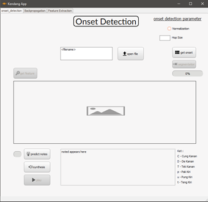

[](https://www.python.org/)

# Onset Detection & Backpropagation Neural Network Implementation of Transcription Kendang Tunggal Instrument 

This project is a masterpiece for my thesis in order to get a bachelor's degree in computer science, thank you for seeing this and know if you are on a difficult road, come on don't struggle keep giving up

# Abstract

Bali has a diversity of arts that has been recognized by the world, where one of the most famous Balinese arts is the Karawitan art, especially the Kendang Tunggal instrument. Notation documentation or more commonly known as music transcription, can make learning a song easier, and in the case of this research, it makes it easier to learn to play the Kendang Tunggal instrument.
The first approach method used to document a kendang tunggal song is onset detection. Onset is when the signal experiences an attack period, which helps segment the sound color of the drum instrument. The segmented kendang tunggal sound color classification uses the Backpropagation algorithm with several features of the frequency domain and time domain as a characteristic of the sound color. Then the kendang tunggal song is revived into a synthetic sound with the Mel Spectral Approximation filter.
Based on the research, the optimal parameter for drum sound color segmentation with onset detection is the hop size 110 with normalization of the features on its onset detection function. The optimal backpropagation architecture obtained with a learning rate of 0.9, neurons 10, and epoch 2000 produces an accuracy of 60.85%. The synthesis method using the Mel Log Spectrum Approximation can make synthetic sounds similar to kendang songs with an accuracy of 83.33%
.

## Requirement Library 
[](https://github.com/bayuwira/Kendang-Tunggal-Classification-Using-Backpropagation-and-Onset-Detection/blob/master/requirements.txt)

I recommend you to working with the package manager [pip](https://pip.pypa.io/en/stable/) to install the package. Or you can just click that badge and they will be installed using
```
pip install -r requirements.txt
```

list of requirement package :
```bash
PyQt5==5.15.2
setuptools==50.3.2
numpy==1.19.3
librosa==0.8.0
pysptk==0.1.18
ipython==7.19.0
matplotlib==3.3.3
SoundFile==0.10.3.post1
scipy==1.5.4
pydub==0.24.1
pandas==1.1.4
mpmath==1.2.1
scikit-learn==0.23.2
natsort==7.1.1
tqdm==4.51.0
```
## How To Use 😜
Really? Do you ask how to use this? Just Kidding, the main function is on [KendangAppFix.py](https://github.com/bayuwira/Kendang-Tunggal-Classification-Using-Backpropagation-and-Onset-Detection/blob/master/KendangAppFix.py), just run it, and you will see the beautiful GUI using [pyqt5](https://pypi.org/project/PyQt5/) like this :
 


Select the audio dataset file at [dataset validation folder](https://github.com/bayuwira/Kendang-Tunggal-Classification-Using-Backpropagation-and-Onset-Detection/tree/master/dataset/data_val) and click the `get onset` button and ride it! 

## Feedback 💋
[](https://www.instagram.com/bayuwirab/)

If you want to ask something or just want to greet and follow my social media please press the badge or find me at

[](https://web.facebook.com/bayuwira1718/)

[](https://www.linkedin.com/in/bayuwira)

[](https://www.instagram.com/bayuwirab/)

## Contributing 👀
Pull requests are welcome. For major changes, please open an issue first to discuss what you would like to change.

Please make sure to update tests as appropriate.

## License
[](https://creativecommons.org/publicdomain/zero/1.0/)
